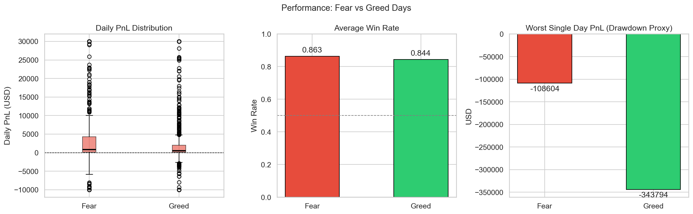
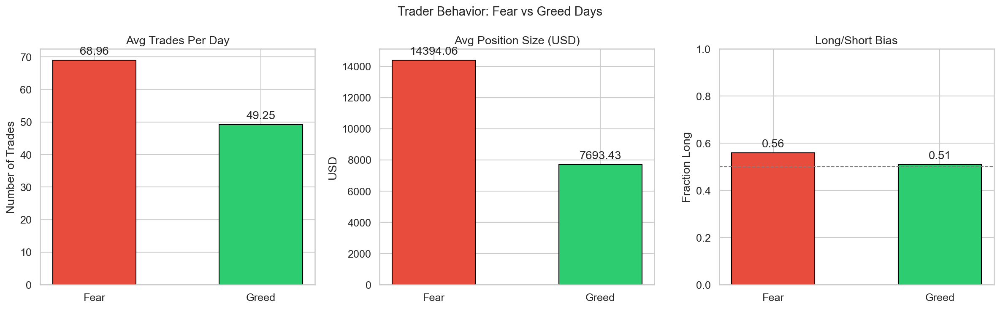
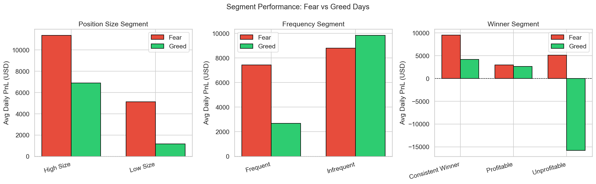
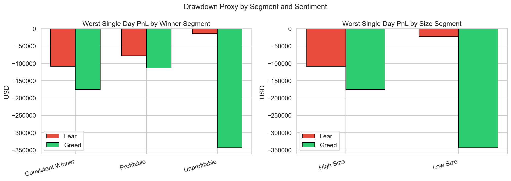
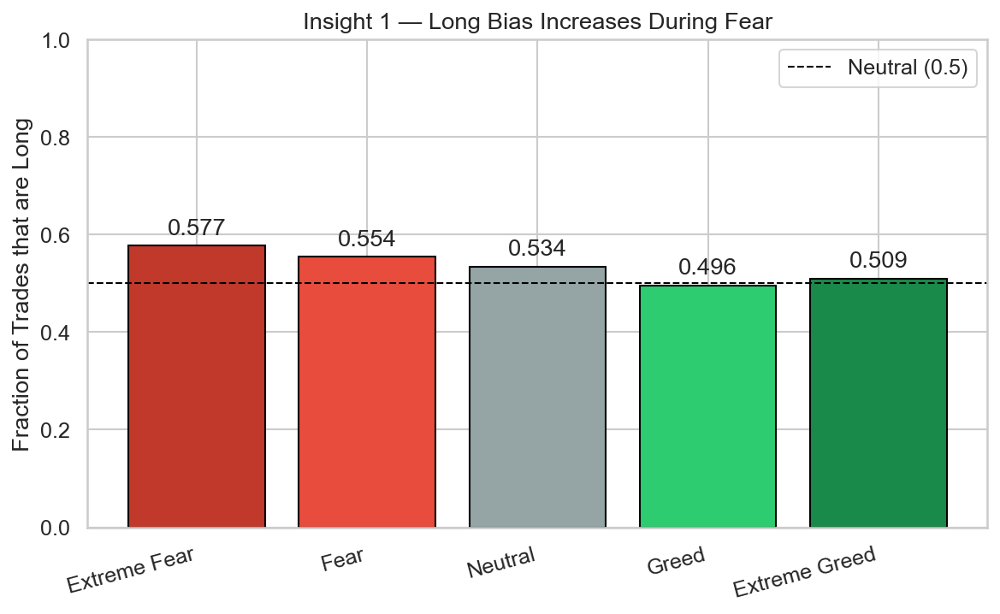
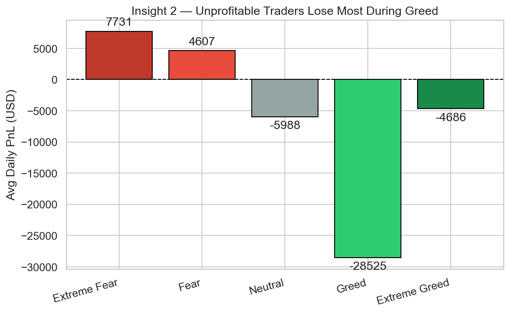
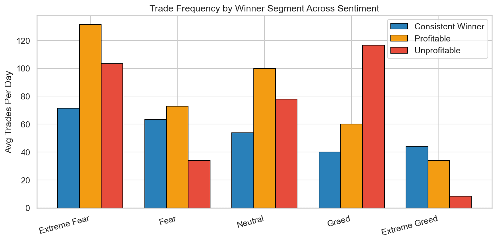
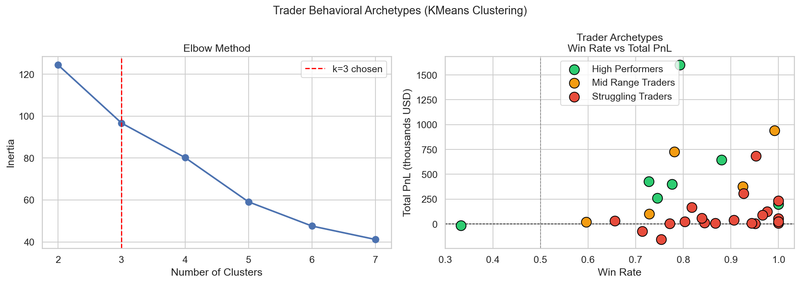
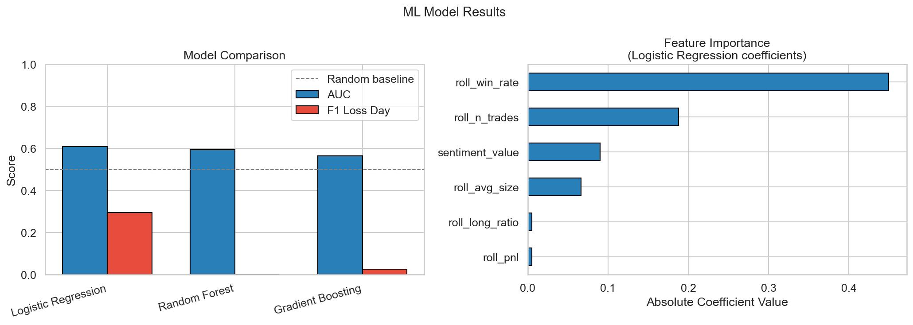
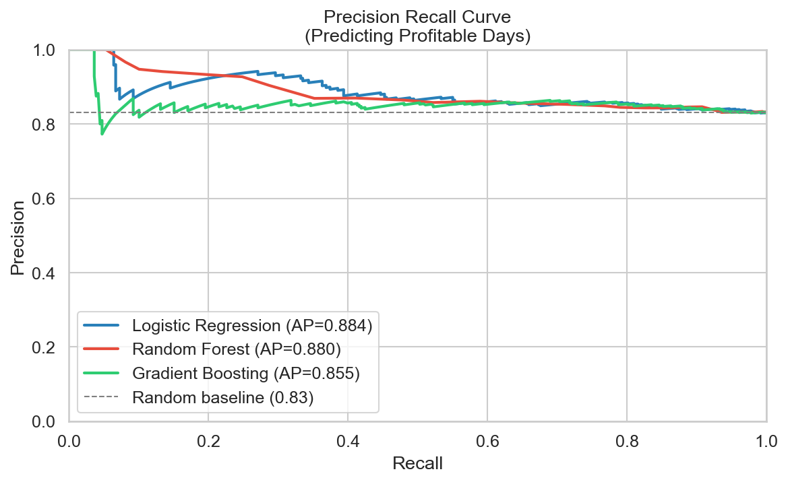

# Primetrade.ai: Trader Performance vs Market Sentiment

This repository contains my submission for the Primetrade.ai Data Science Intern assignment. The objective is to analyze how broad crypto market sentiment (Bitcoin Fear/Greed Index) relates to trader behavior and performance on the Hyperliquid exchange, and to develop actionable trading strategies based on those patterns.

## Repository Structure
* `trader_sentiment_analysis.ipynb`: The main Jupyter Notebook containing all data pipeline logic, EDA, statistical testing, and machine learning models.
* `README.md`: Project summary, methodology, and findings.
* `*.png`: Output charts generated during the analysis, embedded in this report.
* Note: The raw `historical_data.csv` and `fear_greed_index.csv` files must be placed in the root directory to run the notebook, but are excluded from version control due to size constraints.

## Setup and Reproducibility
To run this analysis locally:
1. Clone the repository.
2. Install the required dependencies: `pip install pandas numpy matplotlib seaborn scikit-learn scipy`
3. Ensure the raw CSV files are in the same directory as the notebook.
4. Execute `trader_sentiment_analysis.ipynb` from top to bottom. The notebook is strictly sequential with no hardcoded local paths.

---

## Part A: Data Preparation and Methodology

The raw data required several critical transformations before analysis to ensure accurate aggregations and prevent data leakage.

1. **Timezone Alignment:** The Hyperliquid trade timestamps were provided in IST (UTC+5:30), while the Fear/Greed index operates on UTC dates. Timestamps were strictly converted to UTC before date extraction. Without this step, approximately 53,000 trades (25% of the dataset) would have been merged to the wrong sentiment day.
2. **Noise Filtering:** Spot trades, dust conversions, and settlement events were dropped to isolate intentional trading behavior (Perpetual Futures Opens/Closes).
3. **PnL vs. Behavior Separation:** For performance metrics (PnL, Win Rate), only closing trades were evaluated, as opening trades artificially drag realized PnL toward zero. For behavioral metrics (frequency, size), all perpetual trades were included.
4. **Leverage Proxy:** The provided dataset lacked an explicit leverage column. Rather than constructing a noisy token-to-USD ratio, `Size USD` was utilized as a direct proxy for capital-at-risk and exposure.

---

## Part B: Analysis and Core Insights

### 1. Performance Differences Across Sentiment Regimes

Performance differs significantly between market regimes. The Mann-Whitney U test confirms (p=0.0023) that traders on this platform perform better during Fear than Greed. 
* Mean daily PnL on Fear days is $7,669 compared to $3,338 on Greed days.
* The worst single-day drawdown on Greed days (-$343,794) is more than three times deeper than the worst drawdown on Fear days (-$108,605).

### 2. Behavioral Shifts

Contrary to the assumption that fear causes market paralysis, these traders increase activity during fearful regimes. 
* Average position size during Fear ($14,394) is nearly double that of Greed ($7,693).
* Long bias increases from 0.51 during Greed to 0.56 during Fear, indicating systematic dip-buying behavior.

### 3. Trader Segmentation

Traders were grouped into segments based on historic medians: Position Size (High/Low), Frequency (Frequent/Infrequent), and Profitability Type (Consistent Winner/Profitable/Unprofitable).
* **Size:** High-size traders outperform low-size traders universally, but the gap widens significantly during Fear, suggesting larger accounts have better systems for exploiting volatility.
* **Winner Type:** Consistent winners generate the bulk of their profit during Fear. Unprofitable traders manage to stay net-positive during Fear but experience severe drawdowns during Greed.

### 4. Key Insights Backed by Data

**Insight 1: Long bias scales monotonically with market fear.**

Traders do not panic sell; they systematically buy dips. The long ratio steadily decreases from 0.577 on Extreme Fear days to 0.496 on Greed days. This deliberate counter-cyclical strategy drives the higher average PnL seen during Fear regimes.

**Insight 2: Unprofitable traders blow up their accounts on Greed days due to overtrading.**

Unprofitable traders actually average +$7,731 per day during Extreme Fear. However, during Greed regimes, they average -$28,525 per day. The frequency data explains why: they execute 116 trades per day during Greed cycles. Their core issue is not an inability to trade, but momentum-chasing and overtrading during bullish sentiment.

**Insight 3: High-size traders are regime-agnostic; low-size traders are highly vulnerable.**

High-size traders maintain consistent, positive daily PnL across every single sentiment level. Low-size traders see strong returns on Extreme Fear ($11,507) but collapse to negative returns on Greed (-$37). Larger accounts exhibit strict risk management regardless of the index, whereas smaller accounts are heavily sentiment-dependent.

---

## Part C: Actionable Strategy Output

Based on the behavioral divergence identified in Part B, I propose the following rules for exchange-level risk management or algorithmic implementation:

**Strategy 1: The FOMO Risk Shield (Target: Unprofitable & Low Size Segments)**
* **Rule:** When the Fear/Greed Index crosses above 55, dynamically reduce maximum position size limits by 50% and implement a daily trade-frequency cap (e.g., max 20 trades) for accounts categorized as 'Unprofitable'. Resume standard limits only when the index drops below 45.
* **Justification:** Data shows this specific segment destroys its portfolio via high-frequency momentum chasing during Greed cycles. Programmatically capping their exposure during these periods protects the user from total liquidation, extending their lifetime value on the platform and reducing bad debt risk for the exchange.

**Strategy 2: The Volatility Liquidity Protocol (Target: Consistent Winners & High Size Segments)**
* **Rule:** When the Fear/Greed Index drops below 30, automatically trigger temporary maker-fee rebates and relax API rate limits for 'Consistent Winners'.
* **Justification:** Top-performing traders act as vital liquidity providers during market panic. Incentivizing their volume when the index signals Extreme Fear ensures deep order book liquidity exactly when retail traders are panic-selling, generating stable volume revenue for the exchange.

---

## Bonus Section: Machine Learning & Behavioral Clustering

### Behavioral Archetypes (K-Means Clustering)

Using K-Means (k=3), the 32 accounts were clustered into behavioral archetypes based on total PnL, win rate, and volatility:
1. **High Performers:** Average PnL of $502k. Interestingly, they have a lower win rate (0.75) than struggling traders. They size their winning trades heavily and cut losses quickly.
2. **Mid Range Traders:** Average PnL of $433k. Highly frequent traders who rely on volume over individual large wins.
3. **Struggling Traders:** Average PnL of $82k. They have the highest win rate (0.88) but the lowest total PnL. They take frequent small profits but hold massive losers, proving win rate is a flawed metric in isolation.

### Predictive Modeling

A classification pipeline was built to predict next-day account profitability. 
* **Design:** Time-series cross-validation was used to prevent data leakage. Features consisted of rolling 7-day behavioral averages shifted forward by one day.
* **Results:** A fine-tuned Logistic Regression model (with balanced class weights to handle the 88% profitability imbalance) achieved an Average Precision of 0.8903 on the unseen test set.
* **Feature Importance:** A trader's rolling win rate and rolling trade frequency are the strongest predictors of future success. Furthermore, raw Sentiment Value ranked third in importance, confirming that broad market sentiment adds independent predictive signal beyond historical trader behavior alone.